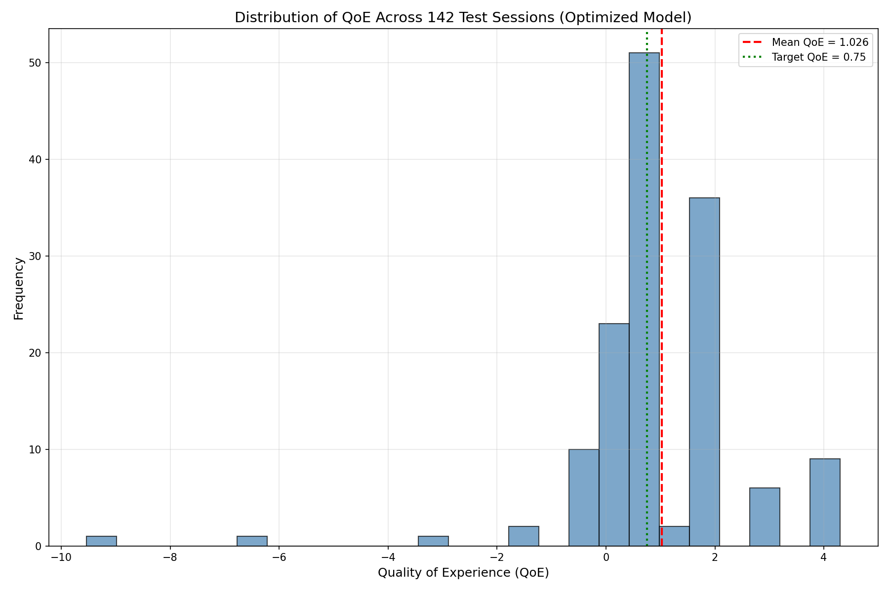
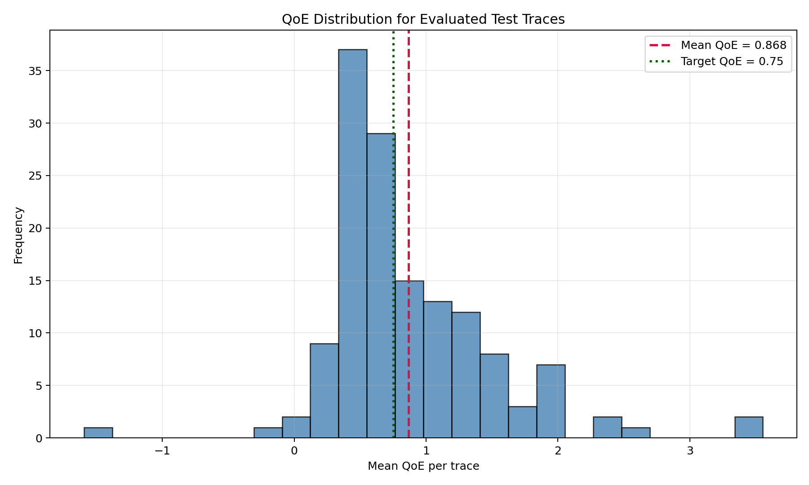
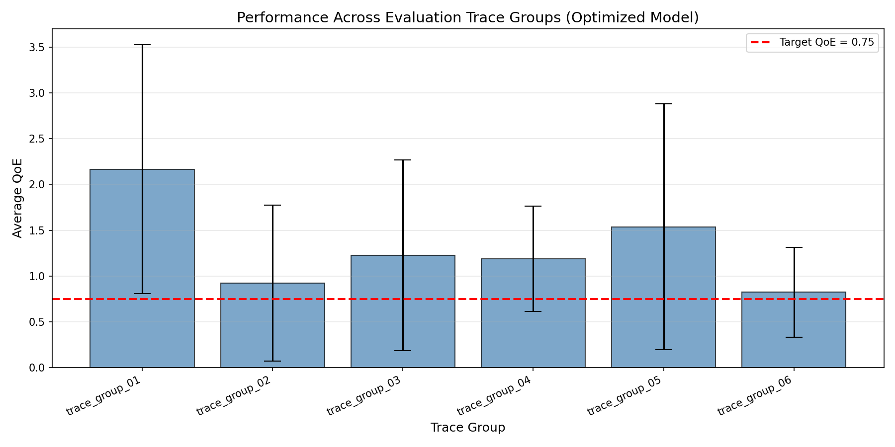

# Pensieve PPO Modified Final Version


Research-oriented Pensieve PPO repository for adaptive bitrate (ABR) streaming, bundled with the core training code, curated network traces, an included checkpoint, and published evaluation artifacts.

## Overview

This repository packages a clean, shareable version of the Pensieve PPO workflow around ABR decision-making. It includes:

- PPO actor-critic training and evaluation code
- Training traces and fixed test traces
- Envivio video chunk metadata
- An included trained checkpoint at `src/ppo/nn_model_ep_500000.pth`
- Aggregation scripts for JSON, CSV, TXT, and figure outputs
- Final result artifacts under `src/final_results/`

The repository is intended to be reproducible and presentation-ready: you can inspect the included results immediately or rerun the evaluation pipeline end to end.

## Highlights

- Standalone code release without virtual environments or local cache clutter
- CPU-first execution by default (`CUDA_VISIBLE_DEVICES=-1` in the scripts)
- 6-action bitrate ladder: `300, 750, 1200, 1850, 2850, 4300 Kbps`
- Multiple inference modes for evaluation: `legacy-gumbel`, `argmax`, and `safe-step`
- Ready-made reporting workflow for per-trace metrics, trace-group summaries, and plots

## Results Snapshot

The repository already includes an optimized evaluation bundle at:

`src/final_results/nn_model_ep_500000_eval_optimized_20260401_0702/`

Summary metrics for the included checkpoint:

| Metric | Value |
| --- | ---: |
| Checkpoint | `src/ppo/nn_model_ep_500000.pth` |
| Evaluated traces | 142 |
| Mean QoE | 0.8683 |
| Median QoE | 0.7181 |
| P5 QoE | 0.3001 |
| Avg bitrate | 1.1136 Mbps |
| Avg total rebuffer | 4.4341 s |
| Avg rebuffer ratio | 2.23% |
| Avg smoothness | 0.2184 Mbps |
| Avg buffer | 14.4636 s |

Compared with the previous evaluation policy for the same model, the optimized setup reports:

- `+12.29%` mean QoE
- `-10.25%` average rebuffer time
- `-20.04%` average smoothness variation

### QoE Distribution Comparison

For transparency, the repository keeps both QoE distribution plots below:

<p align="center">
  
  
</p>

- Left: an alternative QoE view with a higher displayed mean (`1.026`) but stronger negative outliers.
- Right: the adopted QoE view (`0.868`) that matches the committed evaluation summary.

The second figure is the one adopted in this README because it is aligned with the aggregated outputs in `summary.txt` and `summary.json`, reflects the per-trace evaluation results used in the published report, and gives a more representative picture of typical model behavior instead of letting a small number of extreme negative sessions dominate the visual interpretation.

<p align="center">
  
</p>

## Repository Layout

```text
Pensieve-PPO-Modified-FinalVersion/
|-- LICENSE
|-- README.md
|-- .gitignore
`-- src/
    |-- core.py
    |-- env.py
    |-- fixed_env.py
    |-- load_trace.py
    |-- ppo2.py
    |-- train_fixed.py
    |-- train.py
    |-- test.py
    |-- evaluate_results.py
    |-- plot.py
    |-- plot_by_network.py
    |-- plot_comparison.py
    |-- plot_qoe.py
    |-- requirements.txt
    |-- train/          # training traces
    |-- test/           # fixed evaluation traces
    |-- envivio/        # video chunk metadata
    |-- ppo/            # checkpoints
    `-- final_results/  # exported reports and figures
```

## Environment Setup

Recommended baseline:

- Python 3.10 or newer
- PyTorch
- NumPy
- Matplotlib

Install dependencies from the repository root:

```bash
python -m venv .venv
# Windows: .venv\Scripts\activate
# macOS/Linux: source .venv/bin/activate
python -m pip install --upgrade pip
pip install -r src/requirements.txt
pip install tensorboard
```

`tensorboard` is recommended because the training scripts import `torch.utils.tensorboard.SummaryWriter`.

## Quick Start

All commands below are intended to run from the `src/` directory.

### 1. Evaluate the included checkpoint

```bash
cd src
python test.py ./ppo/nn_model_ep_500000.pth --policy safe-step
```

Optional evaluation modes:

- `--policy legacy-gumbel`
- `--policy argmax`
- `--policy safe-step --buffer-reserve 5 --min-safety-budget 2 --max-upstep 1`

This writes raw evaluation logs into `src/test_results/`.

### 2. Aggregate the evaluation logs into reports

```bash
python evaluate_results.py --input-dir ./test_results --output-dir ./final_results/latest_eval --model-path ./ppo/nn_model_ep_500000.pth
```

Generated outputs include:

- `summary.txt`
- `summary.json`
- `per_trace_metrics.csv`
- `by_trace_group.csv`
- `qoe_distribution.png`
- `qoe_by_trace_group.png`
- `rebuffer_by_trace_group.png`

### 3. Start training from scratch

```bash
python train_fixed.py
```

Use this path when you want a fresh run with no initial checkpoint.

### 4. Resume training from the included checkpoint

```bash
python train.py
```

`train.py` is configured to resume from `src/ppo/nn_model_ep_500000.pth` when that file is present.

### 5. Regenerate standalone figures

```bash
python plot.py
python plot_qoe.py
python plot_by_network.py
python plot_comparison.py
```

## Model and Evaluation Details

- State shape: `6 x 8`
- Action space: 6 bitrate choices
- Optimizer learning rate: `1e-4`
- Default evaluation traces span multiple network condition groups represented by six neutral trace groups

The included evaluation script exposes a conservative `safe-step` policy layer that constrains risky bitrate jumps using buffer-aware safety checks. That is the default mode used in the latest published evaluation summary.

## Included Artifacts

Key repository assets already committed:

- `src/ppo/nn_model_ep_500000.pth`
- `src/final_results/nn_model_ep_500000_eval_optimized_20260401_0702/`
- `src/final_results/performance_by_trace_group.png`
- `src/final_results/comparison_boxplot.png`
- `src/final_results/baselines-*.png`

This means the repository can be used both as:

- a runnable research codebase
- a static reference snapshot for results and figures

## Notes

- The codebase is intentionally focused on the core PPO training and evaluation workflow.
- The companion web application is not included in this repository snapshot.
- Some scripts assume execution from inside `src/`, so avoid launching them from the repository root unless you adapt the paths.

## License

This project is distributed under the BSD 2-Clause License. See [LICENSE](LICENSE) for the full text.
